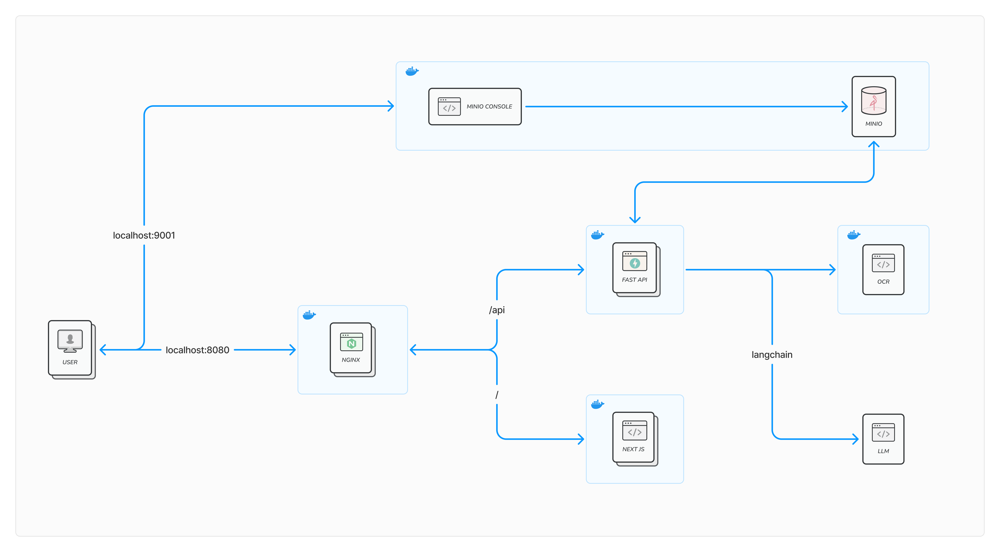

# Maintenance Document & Development environment
**Project name:** acc education 2024 <br>
**ReadMe Version:** 1.0.0 <br>
**Created by:** Parinthon Nearmnala <br>
**Created date:** 10 November 2024

## Environment

The project is developed and tested with the following environment:

- Docker version: 27.3.1
- Nextjs 14 version: 14.2.17
- FastAPI: 0.111.0
- nodejs version: 20

## Software Version

Semantic Versioning with 3-component (X.Y.Z) number is used for giving version
to software at certain point
```
X = Major change (eg. add new functionality/feature)
Y = Minor change (eg. add new api/adjuest UI)
Z = PATCH (eg. bug fix)
```

## Project structure

this project composed of 2 modules including frontend, backend 

```
├── backend
|   ├── lib
|   ├── routers
|   └── main.py
|   
└── frontend
    └── app
```

## Preparation for development

1. Start the project run command

`````
docker compose up -d
`````

2. View logs of containers
```
docker compose logs -f
```
----
<br>

3. To stop the docker 
```
docker compose down
```

## Port mapping

- 8080 NGINX (ingress)
- 9000/9001 - Minio
- 3000 - Next.js - internally
- 80 - FastAPI - internally

## Nginx Path mapping

- localhost:8080 - web
- localhost:9001 - minio console
- localhost:8080/api - api
- localhost:8080/api/docs - api document

## Architecture


